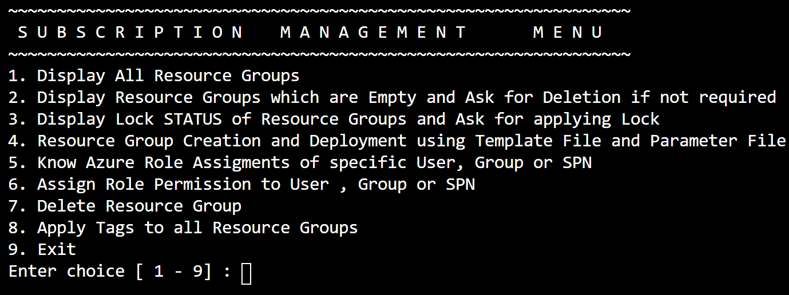
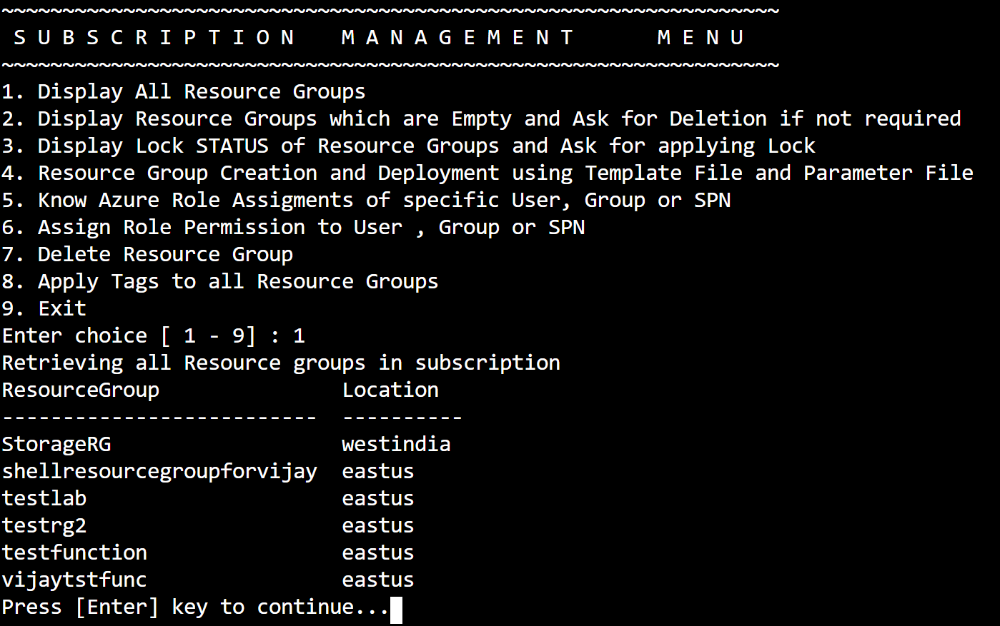
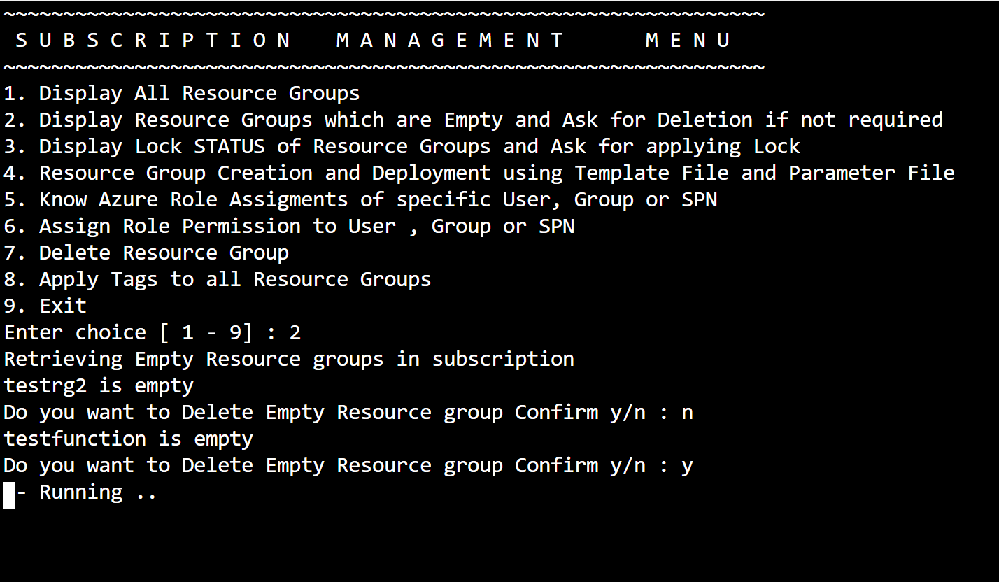
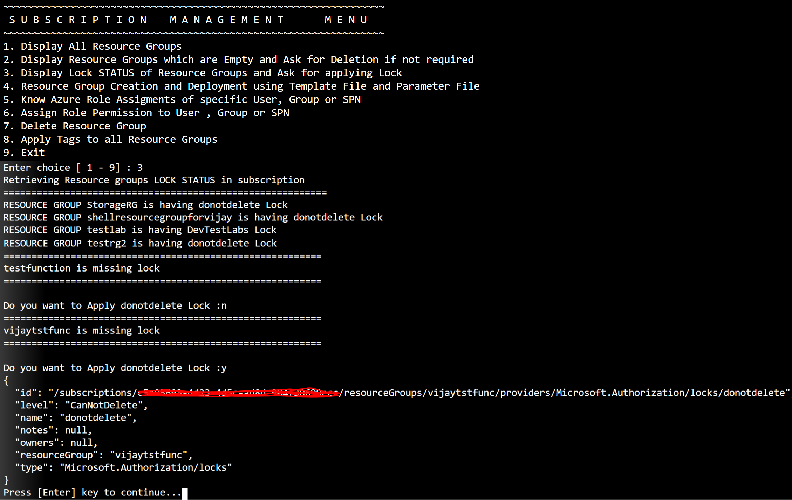
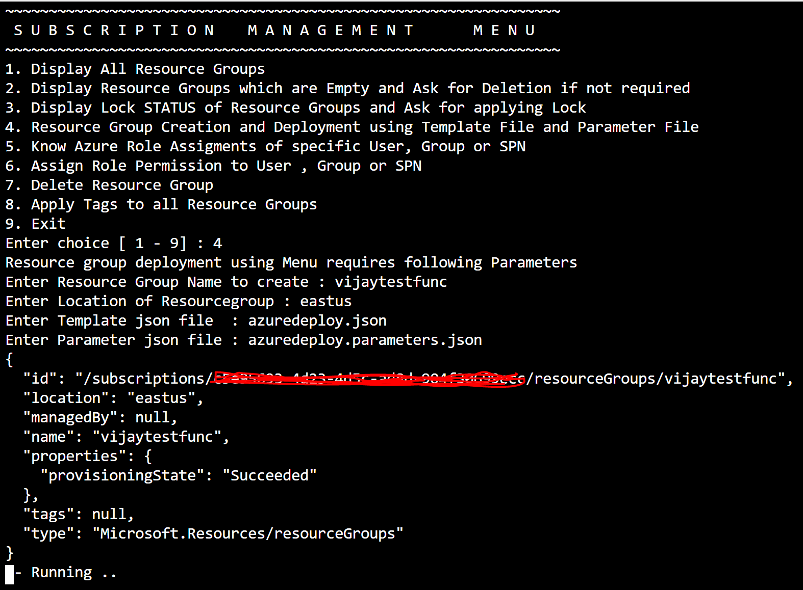
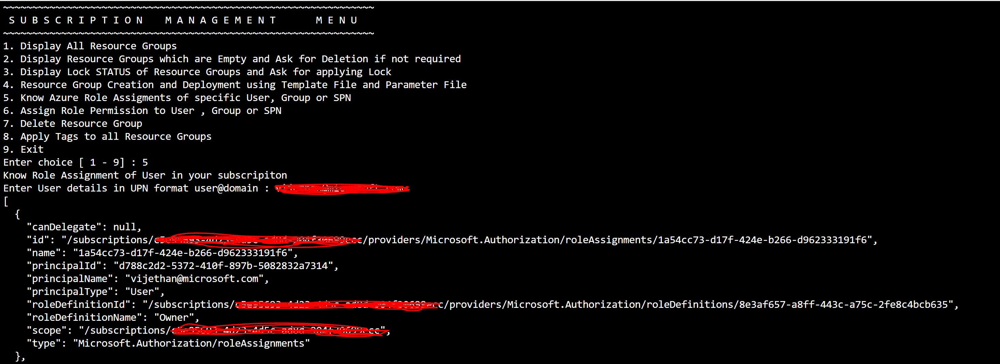
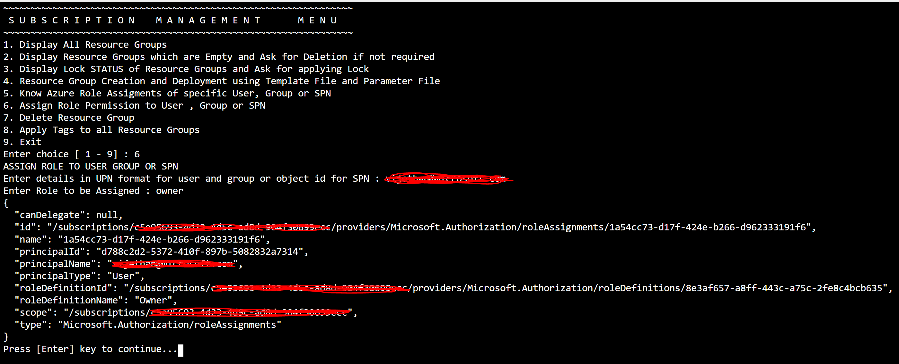
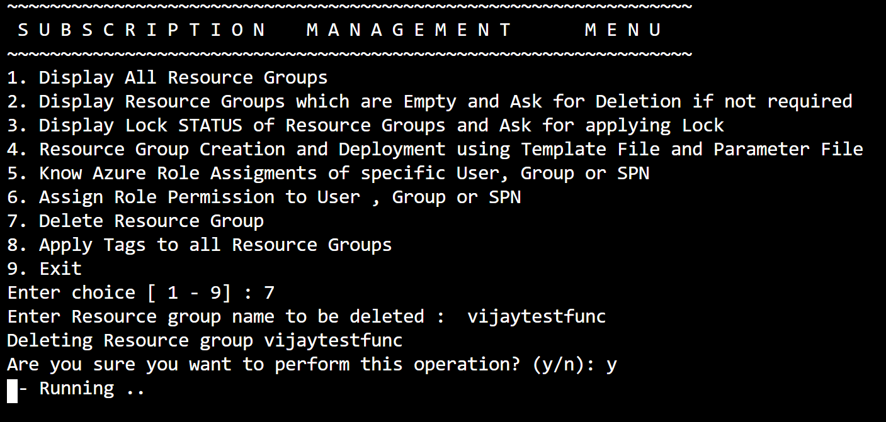
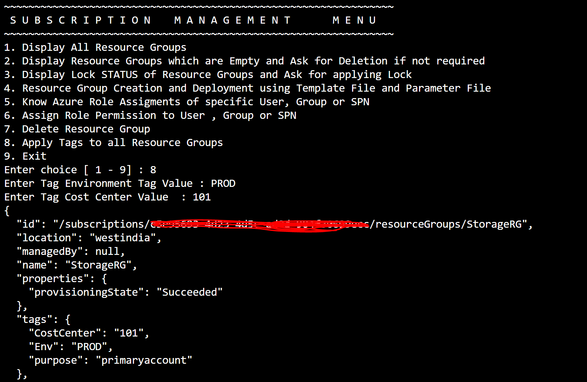
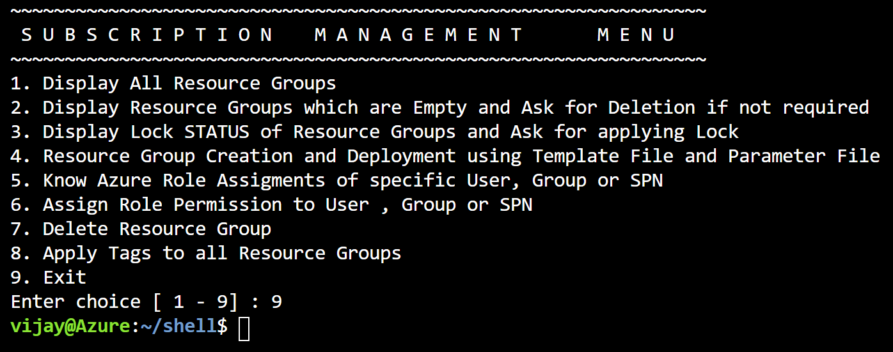

__MENU DRIVEN AZURE AUTOMATION__

Menu Driven program is written keep in mind Task which we do regulary on our Azure subscripitons , at times it is difficult to get commands , syntax and parameters. So these menu driven task provides us automation for our subscription management. Depending on Task we want to perform we provide required Menu List number for that task. Program will ask us input relevant to task we want to perform if required. There is no need remember any command line. This has helped me keep my subscription clean and manageable. Hence sharing this menu drive script as reusuable script which you can program according to your needs.

Script is named menuscript.txt located in Script folder , after downloading script file you can rename this script to menuscript.sh before running in your environment

__IT IS RECOMMENDED WE RUN THIS MENU DRIVEN SCRIPT IN AZURE CLOUD SHELL AS IT HAS ALL RELEVANT CLIENT BINARIES INSTALLED TO RUN SCRIPT ALONG WITH AZURE CLI. ALSO BY USING AZURE CLI WE ARE USING LATEST CLIENT TOOLS.__

__*FIRST LOOK OF MENU*__ 

__*ENTER 1 TO LIST ALL RESOURCE GROUPS IN YOUR SUBSCRIPTION*__

__*ENTER 2 TO LIST EMPTY RESOURCE GROUPS IN YOUR SUBSCRIPTION*__

__*ASK FOR DELETION OF EMPTY RESOURCE GROUP IF NOT REQUIRED*__

__*ENTER 3 TO LIST RESOURCE GROUP WHICH ALREADY HAVE LOCKED ON THEM*__

__*WE CAN HAVE MINIMUM CANNOTDELETE LOCK TO PROTECT PRODUCTION RESOURCE GROUPS FOR ANY ACCIDENTAL DELETION*__

__*ENTER 4 TO CREATE RESOURCE GROUP AND DEPLOYMENT USING TEMPLATE FILE AND PARAMETER FILE*__

__*FOR TESTING azuredeploy.json and azuredeploy.parameter.json FILES ARE PROVIDED IN SCRIPT FOLDER*__

__*ENTER 5 TO VIEW ROLE ASSIGNMENT OF USER , GROUP OR SPN*__

__*FOR USER AND GROUP YOU CAN PROVIDE INPUT AT USER@DOMAIN.COM OR GROUP@DOMAIN.COM*__

__*ALTERNATIVELY YOU CAN PROVIDE OBJECT ID FOR USER , GROUP OR SPN*__

__*ENTER 6 FOR ROLE ASSIGNMENT OF USER , GROUP OR SPN*__

__*FOR USER AND GROUP YOU CAN PROVIDE INPUT AT USER@DOMAIN.COM OR GROUP@DOMAIN.COM*__

__*ALTERNATIVELY YOU CAN PROVIDE OBJECT ID FOR USER , GROUP OR SPN*__

__*ENTER OWNER , CONTRIBUTOR OR RELEVANT ROLE GROUP PERMISSION'S YOU WANT TO ASSIGN TO USER GROUP OR SPN*__

__*ENTER 7 TO DELETE RESOURCE GROUP*__

__*WE NEED TO INPUT RESOURCEGROUPNAME TO DELETE*__

__*ENTER 8 TO APPLY TAGS TO ALL RESOURCE GROUPS*__

__*IN THIS SCRIPT I HAVE USED TAGS ENV AND COSTCENTER FOR EACH RESOURCE GROUP*__

__*FINALLY ENTER 9 TO EXIT MENU DRIVEN PROGRAM*__

